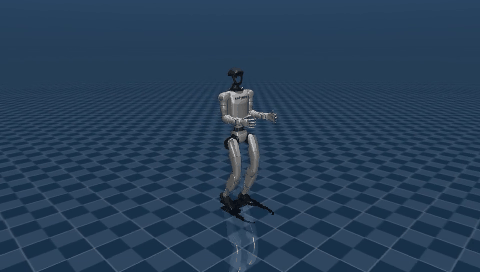
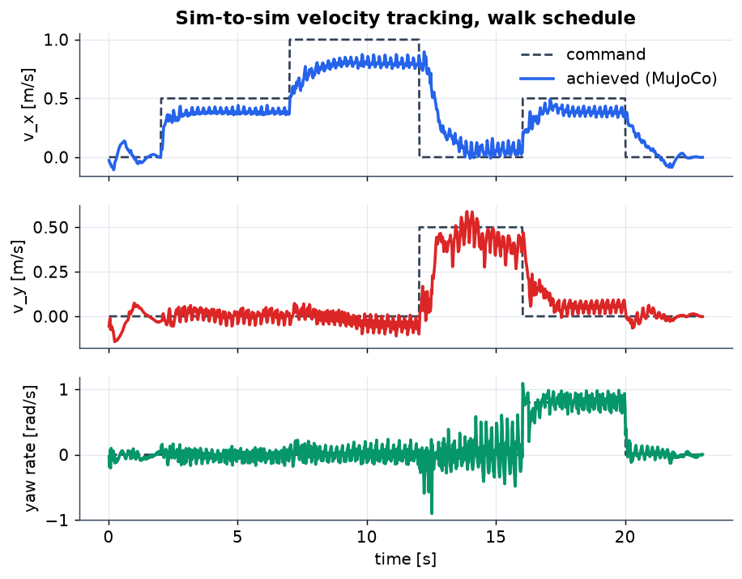
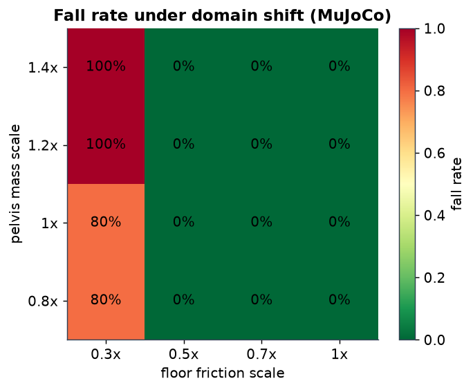
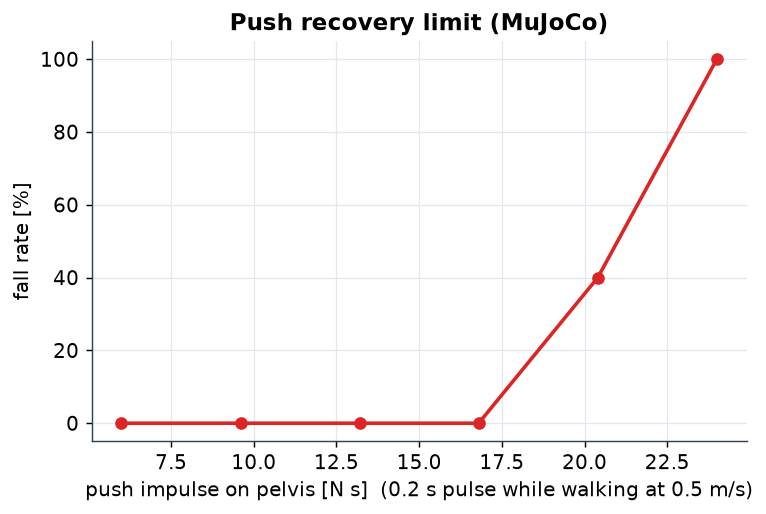
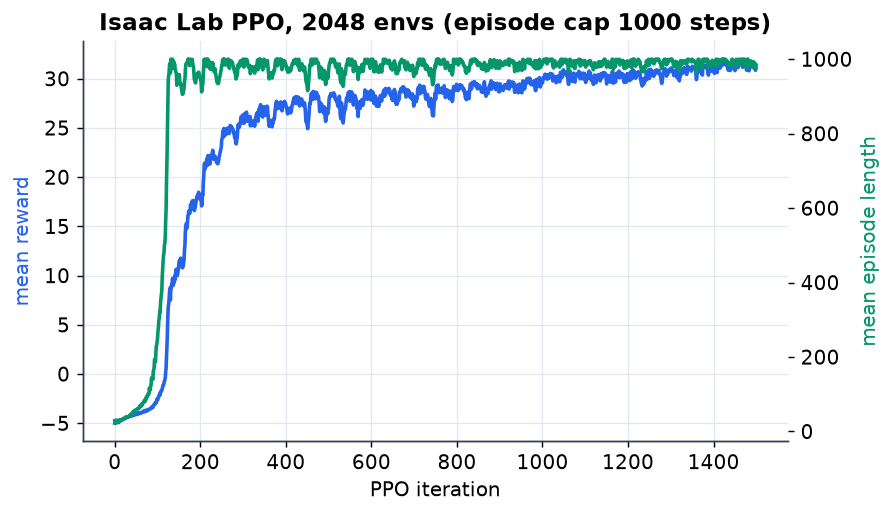
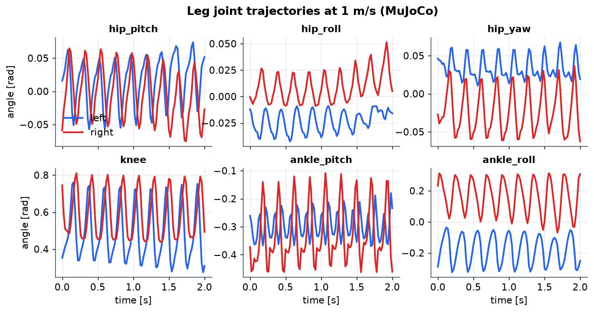
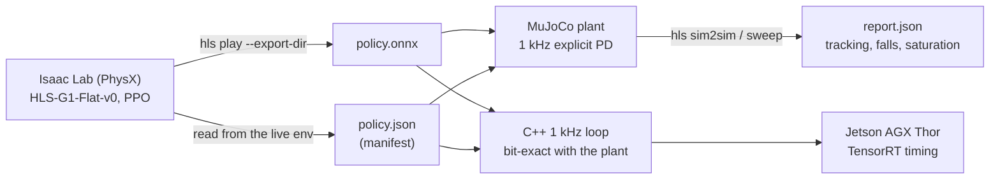

# humanoid-locomotion-sim2sim

**Unitree G1 locomotion from Isaac Lab RL to a deployable 1 kHz control loop, with the transfer
proven in a second simulator.** PPO trains a 12-DOF leg policy in Isaac Lab (PhysX). The policy is
exported to ONNX together with a *manifest* that pins every deployment number. MuJoCo then runs
that exact contract behind an explicit 1 kHz PD loop and reports how well the gait transfers. A
C++ loop reproduces the Python plant bit for bit and runs the same policy in real time.



*MuJoCo, not Isaac: the policy was never trained here.*

---

## Results

| | Isaac Lab (training) | MuJoCo (transfer) |
|---|---|---|
| Achieved speed at 0.5 m/s command | 0.44 m/s | 0.39 m/s |
| Achieved speed at 1.0 m/s command | 1.01 m/s | 0.80 m/s |
| Falls on the 23 s walk schedule (10 seeds) | 0 | 0 |

Sim-to-sim findings, all measured, all reproducible with one command each:

- **Joint armature is the dominant transfer gap.** MuJoCo Menagerie ships the G1 with 0.01 kg m²
  of reflected rotor inertia; the Isaac Lab asset trains with 0.03. With Menagerie's value the
  policy reached 0.63 m/s at a 1.0 m/s command; matching the training value gives 0.80 m/s. Joint
  dry friction (0.3 N m in Menagerie, 0 in training) made no measurable difference. The manifest
  now carries armature and friction, and the scene builder applies them.
- **Push recovery:** survives 84 N for 0.2 s on the pelvis while walking (17 N s), 40 % falls at
  102 N, all fall at 120 N. Training pushes were 0.5 m/s velocity kicks, roughly 17 N s.
- **Domain shift:** zero falls across ±40 % pelvis mass and floor friction from 0.5 to 1.0;
  friction 0.3 fails on every mass. Gyro noise of 0.2 rad/s changes nothing.
- **Latency is the deployment risk.** One policy step (20 ms) of action delay makes 80 % of runs
  fall; two steps, all of them. This policy needs delay randomization in training before it
  goes near hardware. The training config does not have it yet, and the sweep is the reason.
- **A first training run silently failed.** The stock Isaac Lab G1 task terminates only on torso
  contact. On the 29-DOF asset with its softer leg gains PPO found a stable knee-fall (pelvis at
  0.15 m, zero speed) that never terminated and scored a healthy-looking reward. MuJoCo reproduced
  the same kneeling equilibrium, which is how it was diagnosed as a task bug rather than a
  transfer bug. Height and orientation terminations plus a base-height reward fixed it.

| Figure | |
|---|---|
|  |  |
|  |  |



## Pipeline



- **`src/humanoid_loco/isaac/`** — the Isaac Lab task: the stock G1 flat velocity task with the
  29-DOF G1 asset (joint names identical to MuJoCo Menagerie), actions restricted to the 12 leg
  joints, `base_lin_vel` removed from the policy observations (not measurable on hardware) with an
  asymmetric critic that keeps it, and the terminations above. Isaac Lab's pip package ships no
  train/play scripts, so `runner.py` provides them.
- **`manifest.py`** — the single source of truth. Joint order, default pose, PD gains, DC-motor
  saturation, armature, action scale and clip, observation layout, physics and decimation rates.
  Read from the live environment's actuator models and managers, never typed by hand, never
  restated downstream. The Python plant, the C++ loop and the tests all consume it.
- **`obs.py` / `policy.py`** — observation terms as pure numpy mirroring `isaaclab.envs.mdp`,
  assembled in manifest order; an onnxruntime wrapper that keeps `last_action` exact.
- **`mujoco/`** — the plant, built with `MjSpec` from Menagerie's G1: torque motors on policy
  joints with explicit PD and speed-dependent DC-motor torque bounds, position holds on every other
  joint at the training default, an IMU on the pelvis so observations come from sensors. Joint
  order is remapped **by name** (Isaac's USD order interleaves left and right; MJCF does not).
  Rollouts, command schedules, deployment perturbations (mass, friction, gains, action delay,
  sensor noise, push scale), metrics and sweeps.
- **`cpp/`** — the same contract in C++20: manifest, ONNX policy with preallocated tensors, PD,
  a `Plant` interface with MuJoCo behind it, and a paced 1 kHz loop. Built with `-ffp-contract=off`
  so its trajectory is **bit-identical** to the Python plant (`tests/test_cpp_parity.py`).

## Why the plant runs PD at 1 kHz

Isaac Lab applies its PD implicitly inside PhysX at 5 ms. A robot runs an explicit PD in the
motor driver at about 1 kHz while the policy runs at 50 Hz. An explicit PD at 5 ms with the training
gains is unstable, and even where it holds it costs speed (0.54 m/s vs 0.80 at a 1.0 m/s command).
So the plant separates the two rates: `control_dt` is a deployment parameter, the policy rate
comes from the manifest. The C++ loop uses the same split.

C++ loop on this machine (WSL2, non-realtime kernel, i7-14700K), 23 s walk, 23 000 ticks:

| | p50 | p99 | max |
|---|---|---|---|
| Compute per tick (PD + plant, policy every 20th tick) | 43 µs | 129 µs | 2.4 ms |
| Wake jitter vs. the 1 ms schedule | 63 µs | 268 µs | 3.9 ms |
| Policy inference alone, onnxruntime CPU x86 | 6.4 µs | 18 µs | |

The max values are WSL2 scheduler stalls; an RT kernel or a pinned core is the fix, not the code.
Jetson AGX Thor numbers (`deploy/thor/`) are pending access to the device.

## Running it

```bash
# MuJoCo / ONNX / C++ side (no Isaac Sim needed)
uv venv .venv && uv pip install -p .venv/bin/python -e ".[mujoco,dev]"
git clone --depth 1 --filter=blob:none --sparse https://github.com/google-deepmind/mujoco_menagerie third_party/mujoco_menagerie
git -C third_party/mujoco_menagerie sparse-checkout set unitree_g1
pytest -q
hls sim2sim --run runs/g1_flat_12dof/export --commands configs/commands/walk.yaml --video walk.mp4
hls sweep   --run runs/g1_flat_12dof/export --mass 0.8 1.0 1.2 1.4 --friction 0.3 0.5 0.7 1.0
hls sweep   --run runs/g1_flat_12dof/export --delay 0 1 2 3 --gyro-noise 0 0.2
hls report  runs/g1_flat_12dof/export/sweep-walk.json
cmake -S cpp -B build -G Ninja && cmake --build build           # see cpp/README.md for a root-free toolchain
hls prepare-cpp --run runs/g1_flat_12dof/export && build/hls_loop --run runs/g1_flat_12dof/export --schedule runs/g1_flat_12dof/export/schedule-walk.json

# Isaac Lab side (Windows or Linux, RTX GPU, Python 3.11)
scripts/setup-isaaclab-windows.ps1          # Isaac Sim 5.1 + Isaac Lab 2.3.2 via pip (~25 GB)
hls train --headless --num-envs 2048        # 1500 iterations, ~45 min on an RTX 4060 Ti (5.5 GB)
hls play  --checkpoint latest --headless --export-dir runs/g1_flat_12dof/export
```

## What's real vs simulated

| Layer | Status |
|---|---|
| Isaac Lab task, PPO training, ONNX export | **Real.** Stock Isaac Lab 2.3.2 / rsl_rl 3.0.1 machinery, thin runners. |
| Policy manifest | **Real.** Read from the live environment (actuator models, observation manager, action term). |
| MuJoCo plant, PD loop, DC-motor limits, IMU sensors | **Real and unit-tested.** Menagerie G1 with training-asset armature and friction. |
| Sim-to-sim metrics, sweeps, figures | **Real.** No hand-authored data; `scripts/make_figures.py` regenerates everything from the pipeline. |
| C++ 1 kHz loop | **Real.** Bit-exact parity with the Python plant is a CI test. |
| Hardware | **None.** Sim-to-sim is the hardware-free robustness proof; sim-to-real is not claimed. The `Plant` interface is where a robot SDK goes. |

## Layout

```
src/humanoid_loco/
├── manifest.py      policy contract (load/save/validate, torque bounds, joint targets)
├── obs.py           observation terms as numpy, assembled in manifest order
├── policy.py        onnxruntime wrapper
├── isaac/           task cfg, PPO cfg, train/play runners, exporter   (needs Isaac Sim)
├── mujoco/          scene builder (MjSpec), plant, rollouts, metrics  (needs mujoco)
└── cli.py           hls train | play | sim2sim | sweep | report | prepare-cpp | score
cpp/                 hls_loop: manifest, policy, PD, plant, loop (CMake, deps fetched)
configs/commands/    velocity-command schedules (walk, push recovery)
deploy/thor/         inference latency benchmark per execution provider
tests/               Isaac-free: manifest, obs, policy, scene, plant, rollout, metrics, CLI, C++ parity
scripts/             Windows Isaac Lab setup, root-free C++ toolchain, figure generation
```

## License

MIT
