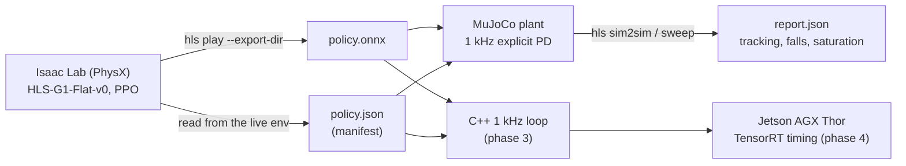

# humanoid-locomotion-sim2sim

**Unitree G1 locomotion from Isaac Lab RL to a deployable control loop, with the transfer proven
in a second simulator.** PPO trains a 12-DOF leg policy in Isaac Lab (PhysX); the policy is
exported to ONNX together with a *manifest* that pins down every deployment number; MuJoCo then
runs that exact contract with an explicit 1 kHz PD loop and reports how well the gait transfers.

<!-- hero: assets/hero.gif -->

Status: **Phase 1 (training) in progress.** The MuJoCo, ONNX and manifest layers are complete
and CI-tested; figures and the sim-to-sim report land once the policy converges.

---

## Pipeline



- **`src/humanoid_loco/isaac/`** — the Isaac Lab task. A subclass of the stock G1 flat velocity
  task with three changes: the 29-DOF G1 asset (joint names identical to MuJoCo Menagerie),
  actions restricted to the 12 leg joints, and `base_lin_vel` removed from the policy
  observations (not measurable on hardware) while an asymmetric critic keeps it. Isaac Lab's pip
  package ships no train/play scripts, so `runner.py` provides them.
- **`manifest.py`** — the single source of truth. Joint order, default pose, PD gains, DC-motor
  saturation, action scale and clip, observation layout, physics/decimation rates. Exported
  from the live environment, never typed by hand, never restated downstream.
- **`obs.py` / `policy.py`** — observation terms as pure numpy mirroring `isaaclab.envs.mdp`,
  assembled in manifest order; an onnxruntime wrapper that keeps `last_action` so the
  `actions` observation is exact.
- **`mujoco/`** — the plant. Menagerie's G1 with its actuators replaced: torque motors on policy
  joints (explicit PD in `env.py`, speed-dependent DC-motor torque bounds), position holds on
  every other joint at the training default, and an IMU on the pelvis so observations come from
  sensors, not privileged state. Joint order is remapped **by name**, which is the step most
  Isaac-to-MuJoCo transfers get wrong.

## Why the plant runs PD at 1 kHz

Isaac Lab applies its PD implicitly inside PhysX at 5 ms. A real robot runs an explicit PD in
the motor driver at about 1 kHz while the policy runs at 50 Hz. An explicit PD at 5 ms with the
training gains is unstable (the tests prove it), so the MuJoCo plant separates the two rates:
`control_dt` is a deployment parameter, the policy rate comes from the manifest. The C++ loop in
phase 3 uses the same split.

## Running it

```bash
# MuJoCo / ONNX side (Linux, macOS, Windows; no Isaac Sim needed)
uv venv .venv && uv pip install -p .venv/bin/python -e ".[mujoco,dev]"
git clone --depth 1 --filter=blob:none --sparse https://github.com/google-deepmind/mujoco_menagerie third_party/mujoco_menagerie
git -C third_party/mujoco_menagerie sparse-checkout set unitree_g1
pytest -q
hls sim2sim --run runs/g1_flat_12dof/export --commands configs/commands/walk.yaml --video walk.mp4
hls sweep   --run runs/g1_flat_12dof/export --mass 0.8 1.0 1.2 1.4 --friction 0.4 0.7 1.0

# Isaac Lab side (Windows or Linux, RTX GPU, Python 3.11)
scripts/setup-isaaclab-windows.ps1          # Isaac Sim 5.1 + Isaac Lab 2.3.2 via pip (~25 GB)
hls train --headless --num-envs 2048
hls play  --checkpoint latest --export-dir runs/g1_flat_12dof/export --video-dir runs/video
```

## What's real vs simulated

| Layer | Status |
|---|---|
| Isaac Lab task, PPO training, ONNX export | **Real.** Stock Isaac Lab 2.3.2 / rsl_rl 3.0.1 machinery, thin runners. |
| Policy manifest | **Real.** Read from the live environment (actuator models, observation manager, action term). |
| MuJoCo plant, PD loop, DC-motor limits, IMU sensors | **Real and unit-tested.** Menagerie G1 model. |
| Sim-to-sim metrics and robustness sweep | **Real.** No hand-authored data; figures regenerate from `scripts/make_figures.py`. |
| Hardware | **None.** Sim-to-sim is the hardware-free robustness proof; sim-to-real is not claimed. |

## Layout

```
src/humanoid_loco/
├── manifest.py      policy contract (load/save/validate, torque bounds, joint targets)
├── obs.py           observation terms as numpy, assembled in manifest order
├── policy.py        onnxruntime wrapper
├── isaac/           task cfg, PPO cfg, train/play runners, exporter   (needs Isaac Sim)
├── mujoco/          scene builder (MjSpec), plant, rollouts, metrics  (needs mujoco)
└── cli.py           hls train | play | sim2sim | sweep
configs/commands/    velocity-command schedules (walk, push recovery)
tests/               Isaac-free: manifest, obs, policy, scene, plant, rollout, metrics
scripts/             Windows Isaac Lab setup, figure generation
```

## License

MIT
